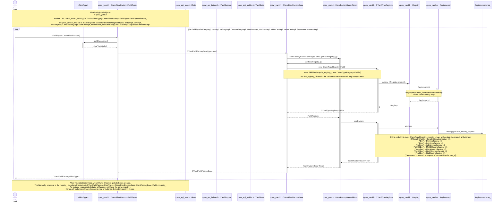

```mermaid
sequenceDiagram
    actor User
    participant FieldType as <FieldType>
    participant CYamlFieldFactory as cpsw_yaml.h : CYamlFieldFactory<FieldType>
    participant IPath as cpsw_api_user.h : IPath
    participant IYamlSupport as cpsw_api_builder.h : IYamlSupport
    participant YamlState as cpsw_api_builder.h : YamlState
    participant CYamlFieldFactoryBase as cpsw_yaml.h : CYamlFieldFactoryBase
    participant IYamlFactoryBase as cpsw_yaml.h : IYamlFactoryBase<Field>
    participant CYamlTypeRegistry as cpsw_yaml.h : CYamlTypeRegistry
    participant IRegistry as cpsw_yaml.h : IRegistry
    participant RegistryImpl as cpsw_yaml.cc : RegistryImpl
    participant Map as RegistryImpl::map_

    note over User,IPath: First load global objects:<br/>In cpsw_yaml.h:<br/><br/>#35;define DECLARE_YAML_FIELD_FACTORY(FieldType) CYamlFieldFactory#60;FieldType#62; FieldType#35;#35;factory_<br/><br/>In cpsw_yaml.cc, the call is made in global scope for the following field types: EntryImpl, DevImpl,<br/>IntEntryImpl, ConstIntEntryImpl, MemDevImpl, NullDevImpl, MMIODevImpl, NetIODevImpl, SequenceCommandImpl
    loop for FieldType in EntryImpl, DevImpl, IntEntryImpl, ConstIntEntryImpl, MemDevImpl, NullDevImpl, MMIODevImpl, NetIODevImpl, SequenceCommandImpl
        User->>+CYamlFieldFactory: <FieldType> CYamlFieldFactory()
            CYamlFieldFactory->>+FieldType: _getClassName()
            FieldType-->>-CYamlFieldFactory: char* typeLabel
            CYamlFieldFactory->>+CYamlFieldFactoryBase: CYamlFieldFactoryBase(typeLabel)
                CYamlFieldFactoryBase->>+IYamlFactoryBase: IYamlFactoryBase<Field>(typeLabel, getFieldRegistry_())
                    IYamlFactoryBase->>CYamlFieldFactoryBase: getFieldRegistry_()
                        CYamlFieldFactoryBase->>+CYamlTypeRegistry: new CYamlTypeRegistry<Field>
                        note over CYamlFieldFactoryBase,CYamlTypeRegistry: static FieldRegistry the_registry_( new CYamlTypeRegistry<Field> )<br/><br/>As "the_registry_" is static, the call to the constructor will only happen once.
                            CYamlTypeRegistry->>+IRegistry: registry_(IRegistry::create())
                                IRegistry->>+RegistryImpl: RegistryImpl()
                                note over IRegistry,RegistryImpl: RegistryImpl::map_ is created automatically<br/>with a default empty map
                                RegistryImpl-->>-IRegistry: RegistryImpl
                            IRegistry-->>-CYamlTypeRegistry: IRegistry
                        CYamlTypeRegistry-->>-CYamlFieldFactoryBase: CYamlTypeRegistry<Field>
                    CYamlFieldFactoryBase-->>IYamlFactoryBase: FieldRegistry
                IYamlFactoryBase->>+CYamlTypeRegistry: addFactory
                    CYamlTypeRegistry->>RegistryImpl: addItem
                        RegistryImpl->>Map: insert(typeLabel, factory_object*)
                        note over CYamlTypeRegistry,Map: In the end of this loop, CYamlTypeRegistry->registry_.map_ will contain the map of all factories:<br/>{["ConstIntField”, <ConstIntEntryImplfactory_>],<br/>["Dev”, <DevImplfactory_>],<br/>["Field”, <EntryImplfactory_>],<br/>["IntField”, <IntEntryImplfactory_>],<br/>["MMIODev”, <MMIODevImplfactory_>],<br/>["MemDev”, <MemDevImplfactory_>],<br/>["NetIODev”, <NetIODevImplfactory_>],<br/>["NullDev”, <NullDevImplfactory_>],<br/>["SequenceCommand”, <SequenceCommandImplfactory_>]}
                CYamlTypeRegistry-->>-IYamlFactoryBase: IYamlFactoryBase<Field>
                IYamlFactoryBase-->>-CYamlFieldFactoryBase: IYamlFactoryBase<Field>
            CYamlFieldFactoryBase-->>-CYamlFieldFactory: CYamlFieldFactoryBase
        CYamlFieldFactory-->>-User: CYamlFieldFactory<FieldType>
    end

    note over User,IPath: After this initialization loop, we will have 9 factory global objects created.<br/>The hierarchy structure to the registry_ member of factories is CYamlFieldFactory<FieldType>::CYamlFieldFactoryBase::IYamlFactoryBase<Field>::registry_<br/>As registry_ was created static, all factories will have the same registry_.<br/>Hence, all factories will have the same map of factories defined in registry_->map_
```
