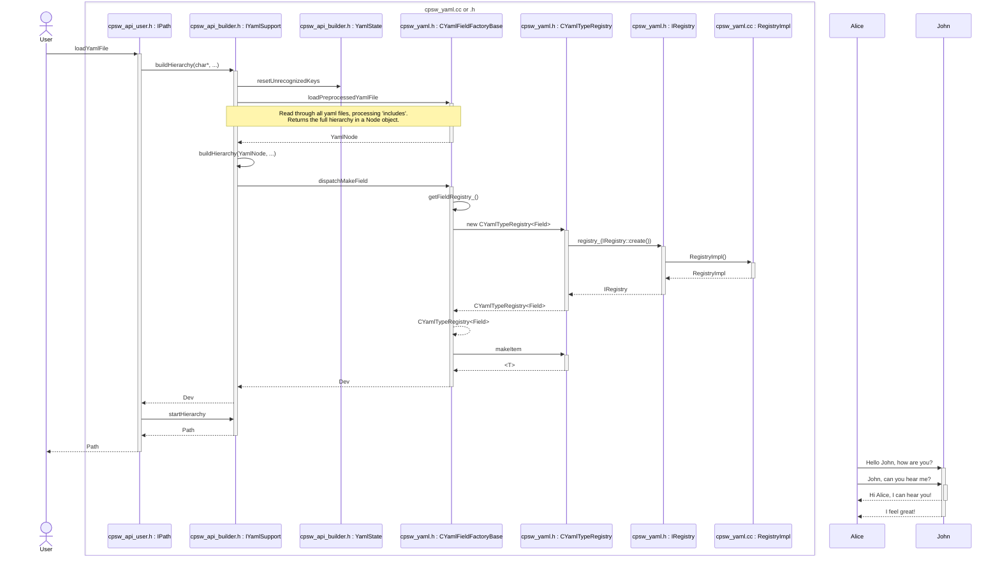

```mermaid
sequenceDiagram
    actor User
    participant IPath as cpsw_api_user.h : IPath
    participant IYamlSupport as cpsw_api_builder.h : IYamlSupport
    participant YamlState as cpsw_api_builder.h : YamlState
    participant CYamlFieldFactoryBase as cpsw_yaml.h : CYamlFieldFactoryBase
    participant CYamlTypeRegistry as cpsw_yaml.h : CYamlTypeRegistry
    participant IRegistry as cpsw_yaml.h : IRegistry
    participant RegistryImpl as cpsw_yaml.cc : RegistryImpl

    box cpsw_yaml.cc or .h
        participant IPath
        participant IYamlSupport
        participant YamlState
        participant CYamlFieldFactoryBase
        participant CYamlTypeRegistry
        participant IRegistry
        participant RegistryImpl
    end

    User->>+IPath: loadYamlFile
    IPath->>+IYamlSupport: buildHierarchy(char*, ...)
        IYamlSupport->>YamlState: resetUnrecognizedKeys
        IYamlSupport->>+CYamlFieldFactoryBase: loadPreprocessedYamlFile
        note over IYamlSupport,CYamlFieldFactoryBase: Read through all yaml files, processing 'includes'.<br/>Returns the full hierarchy in a Node object.
        CYamlFieldFactoryBase-->>-IYamlSupport: YamlNode
        IYamlSupport->>IYamlSupport: buildHierarchy(YamlNode, ...)
        IYamlSupport->>+CYamlFieldFactoryBase: dispatchMakeField
            CYamlFieldFactoryBase->>CYamlFieldFactoryBase: getFieldRegistry_()
            CYamlFieldFactoryBase->>+CYamlTypeRegistry: new CYamlTypeRegistry<Field>
                CYamlTypeRegistry->>+IRegistry: registry_(IRegistry::create())
                    IRegistry->>+RegistryImpl: RegistryImpl()
                    RegistryImpl-->>-IRegistry: RegistryImpl
                IRegistry-->>-CYamlTypeRegistry: IRegistry
            CYamlTypeRegistry-->>-CYamlFieldFactoryBase: CYamlTypeRegistry<Field>
            CYamlFieldFactoryBase-->>CYamlFieldFactoryBase: CYamlTypeRegistry<Field>
            CYamlFieldFactoryBase->>+CYamlTypeRegistry: makeItem
            CYamlTypeRegistry-->>-CYamlFieldFactoryBase: <T>
        CYamlFieldFactoryBase-->>-IYamlSupport: Dev
    IYamlSupport-->>IPath: Dev
    IPath->>IYamlSupport: startHierarchy
    IYamlSupport-->>-IPath: Path
    IPath-->>-User: Path


    Alice->>+John: Hello John, how are you?
    Alice->>+John: John, can you hear me?
    John-->>-Alice: Hi Alice, I can hear you!
    John-->>-Alice: I feel great!
```
