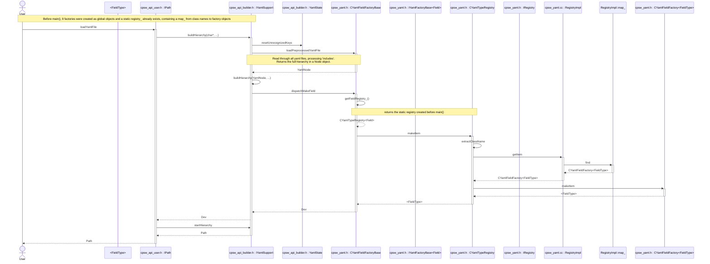

```mermaid
sequenceDiagram
    actor User
    participant FieldType as <FieldType>
    participant IPath as cpsw_api_user.h : IPath
    participant IYamlSupport as cpsw_api_builder.h : IYamlSupport
    participant YamlState as cpsw_api_builder.h : YamlState
    participant CYamlFieldFactoryBase as cpsw_yaml.h : CYamlFieldFactoryBase
    participant IYamlFactoryBase as cpsw_yaml.h : IYamlFactoryBase<Field>
    participant CYamlTypeRegistry as cpsw_yaml.h : CYamlTypeRegistry
    participant IRegistry as cpsw_yaml.h : IRegistry
    participant RegistryImpl as cpsw_yaml.cc : RegistryImpl
    participant Map as RegistryImpl::map_
    participant CYamlFieldFactory as cpsw_yaml.h : CYamlFieldFactory<FieldType>

    note over User,IYamlSupport: Before main(), 9 factories were created as global objects and a static registry_ already exists, containing a map_ from class names to factory objects

    User->>+IPath: loadYamlFile
    IPath->>+IYamlSupport: buildHierarchy(char*, ...)
        IYamlSupport->>YamlState: resetUnrecognizedKeys
        IYamlSupport->>+CYamlFieldFactoryBase: loadPreprocessedYamlFile
        note over IYamlSupport,CYamlFieldFactoryBase: Read through all yaml files, processing 'includes'.<br/>Returns the full hierarchy in a Node object.
        CYamlFieldFactoryBase-->>-IYamlSupport: YamlNode
        IYamlSupport->>IYamlSupport: buildHierarchy(YamlNode, ...)
        IYamlSupport->>+CYamlFieldFactoryBase: dispatchMakeField
            CYamlFieldFactoryBase->>CYamlFieldFactoryBase: getFieldRegistry_()
            note over CYamlFieldFactoryBase,CYamlTypeRegistry: returns the static registry created before main()
            CYamlFieldFactoryBase-->>CYamlFieldFactoryBase: CYamlTypeRegistry<Field>
            CYamlFieldFactoryBase->>+CYamlTypeRegistry: makeItem
                CYamlTypeRegistry->>CYamlTypeRegistry: extractClassName
                CYamlTypeRegistry->>+RegistryImpl: getItem
                    RegistryImpl->>+Map: find
                    Map-->>-RegistryImpl: CYamlFieldFactory<FieldType>
                RegistryImpl-->>-CYamlTypeRegistry: CYamlFieldFactory<FieldType>
                CYamlTypeRegistry->>+CYamlFieldFactory: makeItem
                CYamlFieldFactory-->>-CYamlTypeRegistry: <FieldType>
            CYamlTypeRegistry-->>-CYamlFieldFactoryBase: <FieldType>
        CYamlFieldFactoryBase-->>-IYamlSupport: Dev
    IYamlSupport-->>IPath: Dev
    IPath->>IYamlSupport: startHierarchy
    IYamlSupport-->>-IPath: Path
    IPath-->>-User: Path
```
