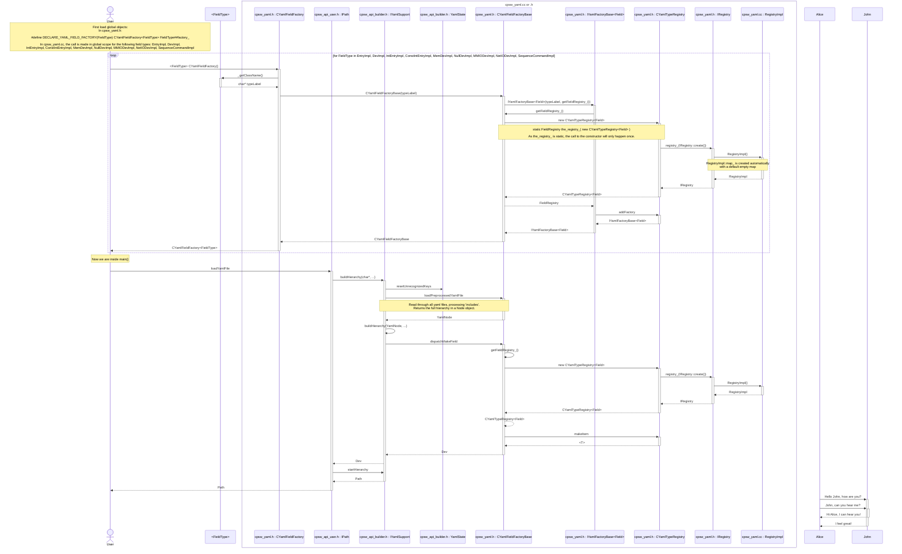

```mermaid
sequenceDiagram
    actor User
    participant FieldType as <FieldType>
    participant CYamlFieldFactory as cpsw_yaml.h : CYamlFieldFactory
    participant IPath as cpsw_api_user.h : IPath
    participant IYamlSupport as cpsw_api_builder.h : IYamlSupport
    participant YamlState as cpsw_api_builder.h : YamlState
    participant CYamlFieldFactoryBase as cpsw_yaml.h : CYamlFieldFactoryBase
    participant IYamlFactoryBase as cpsw_yaml.h : IYamlFactoryBase<Field>
    participant CYamlTypeRegistry as cpsw_yaml.h : CYamlTypeRegistry
    participant IRegistry as cpsw_yaml.h : IRegistry
    participant RegistryImpl as cpsw_yaml.cc : RegistryImpl

    box cpsw_yaml.cc or .h
        participant CYamlFieldFactory
        participant IPath
        participant IYamlSupport
        participant YamlState
        participant CYamlFieldFactoryBase
        participant IYamlFactoryBase
        participant CYamlTypeRegistry
        participant IRegistry
        participant RegistryImpl
    end

    note over User: First load global objects:<br/>In cpsw_yaml.h:<br/><br/>#35;define DECLARE_YAML_FIELD_FACTORY(FieldType) CYamlFieldFactory#60;FieldType#62; FieldType#35;#35;factory_<br/><br/>In cpsw_yaml.cc, the call is made in global scope for the following field types: EntryImpl, DevImpl,<br/>IntEntryImpl, ConstIntEntryImpl, MemDevImpl, NullDevImpl, MMIODevImpl, NetIODevImpl, SequenceCommandImpl
    loop for FieldType in EntryImpl, DevImpl, IntEntryImpl, ConstIntEntryImpl, MemDevImpl, NullDevImpl, MMIODevImpl, NetIODevImpl, SequenceCommandImpl
        User->>+CYamlFieldFactory: <FieldType> CYamlFieldFactory()
            CYamlFieldFactory->>+FieldType: _getClassName()
            FieldType-->>-CYamlFieldFactory: char* typeLabel
            CYamlFieldFactory->>+CYamlFieldFactoryBase: CYamlFieldFactoryBase(typeLabel)
                CYamlFieldFactoryBase->>+IYamlFactoryBase: IYamlFactoryBase<Field>(typeLabel, getFieldRegistry_())
                    IYamlFactoryBase->>CYamlFieldFactoryBase: getFieldRegistry_()
                        CYamlFieldFactoryBase->>+CYamlTypeRegistry: new CYamlTypeRegistry<Field>
                        note over CYamlFieldFactoryBase,CYamlTypeRegistry: static FieldRegistry the_registry_( new CYamlTypeRegistry<Field> )<br/><br/>As the_registry_ is static, the call to the constructor will only happen once.
                            CYamlTypeRegistry->>+IRegistry: registry_(IRegistry::create())
                                IRegistry->>+RegistryImpl: RegistryImpl()
                                note over IRegistry,RegistryImpl: RegistryImpl::map_ is created automatically<br/>with a default empty map
                                RegistryImpl-->>-IRegistry: RegistryImpl
                            IRegistry-->>-CYamlTypeRegistry: IRegistry
                        CYamlTypeRegistry-->>-CYamlFieldFactoryBase: CYamlTypeRegistry<Field>
                    CYamlFieldFactoryBase-->>IYamlFactoryBase: FieldRegistry
                IYamlFactoryBase->>+CYamlTypeRegistry: addFactory
                CYamlTypeRegistry-->>-IYamlFactoryBase: IYamlFactoryBase<Field>
                IYamlFactoryBase-->>-CYamlFieldFactoryBase: IYamlFactoryBase<Field>
            CYamlFieldFactoryBase-->>-CYamlFieldFactory: CYamlFieldFactoryBase
        CYamlFieldFactory-->>-User: CYamlFieldFactory<FieldType>
    end

    note over User: Now we are inside main()
    User->>+IPath: loadYamlFile
    IPath->>+IYamlSupport: buildHierarchy(char*, ...)
        IYamlSupport->>YamlState: resetUnrecognizedKeys
        IYamlSupport->>+CYamlFieldFactoryBase: loadPreprocessedYamlFile
        note over IYamlSupport,CYamlFieldFactoryBase: Read through all yaml files, processing 'includes'.<br/>Returns the full hierarchy in a Node object.
        CYamlFieldFactoryBase-->>-IYamlSupport: YamlNode
        IYamlSupport->>IYamlSupport: buildHierarchy(YamlNode, ...)
        IYamlSupport->>+CYamlFieldFactoryBase: dispatchMakeField
            CYamlFieldFactoryBase->>CYamlFieldFactoryBase: getFieldRegistry_()
            CYamlFieldFactoryBase->>+CYamlTypeRegistry: new CYamlTypeRegistry<Field>
                CYamlTypeRegistry->>+IRegistry: registry_(IRegistry::create())
                    IRegistry->>+RegistryImpl: RegistryImpl()
                    RegistryImpl-->>-IRegistry: RegistryImpl
                IRegistry-->>-CYamlTypeRegistry: IRegistry
            CYamlTypeRegistry-->>-CYamlFieldFactoryBase: CYamlTypeRegistry<Field>
            CYamlFieldFactoryBase-->>CYamlFieldFactoryBase: CYamlTypeRegistry<Field>
            CYamlFieldFactoryBase->>+CYamlTypeRegistry: makeItem
            CYamlTypeRegistry-->>-CYamlFieldFactoryBase: <T>
        CYamlFieldFactoryBase-->>-IYamlSupport: Dev
    IYamlSupport-->>IPath: Dev
    IPath->>IYamlSupport: startHierarchy
    IYamlSupport-->>-IPath: Path
    IPath-->>-User: Path


    Alice->>+John: Hello John, how are you?
    Alice->>+John: John, can you hear me?
    John-->>-Alice: Hi Alice, I can hear you!
    John-->>-Alice: I feel great!
```
