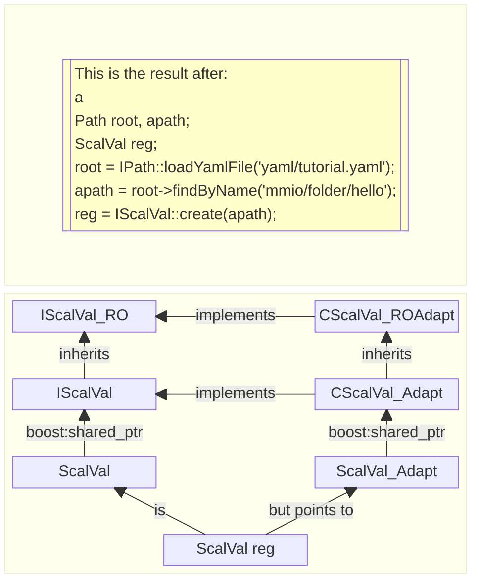

```mermaid
block-beta
    columns 1

    block:note
        columns 1
        %%space
        note1[["This is the result after:
        a
                Path root, apath;
                ScalVal reg;
                root = IPath::loadYamlFile('yaml/tutorial.yaml');
                apath = root->findByName('mmio/folder/hello');
                reg = IScalVal::create(apath);"]]
    end

    block:main
        columns 3
        IScalVal_RO space CScalVal_ROAdapt
        space:3
        IScalVal space CScalVal_Adapt
        space:3
        ScalVal space ScalVal_Adapt
        space:3
        space reg["ScalVal reg"] space

        reg -- "is" --> ScalVal
        reg -- "but points to" --> ScalVal_Adapt
        CScalVal_ROAdapt -- "implements" --> IScalVal_RO
        IScalVal -- "inherits" --> IScalVal_RO
        CScalVal_Adapt -- "inherits" --> CScalVal_ROAdapt
        CScalVal_Adapt -- "implements" --> IScalVal
        ScalVal -- "boost:shared_ptr" --> IScalVal
        ScalVal_Adapt -- "boost:shared_ptr" --> CScalVal_Adapt
    end

    style note1 fill:#FFFFCC,text-align:left;
```
